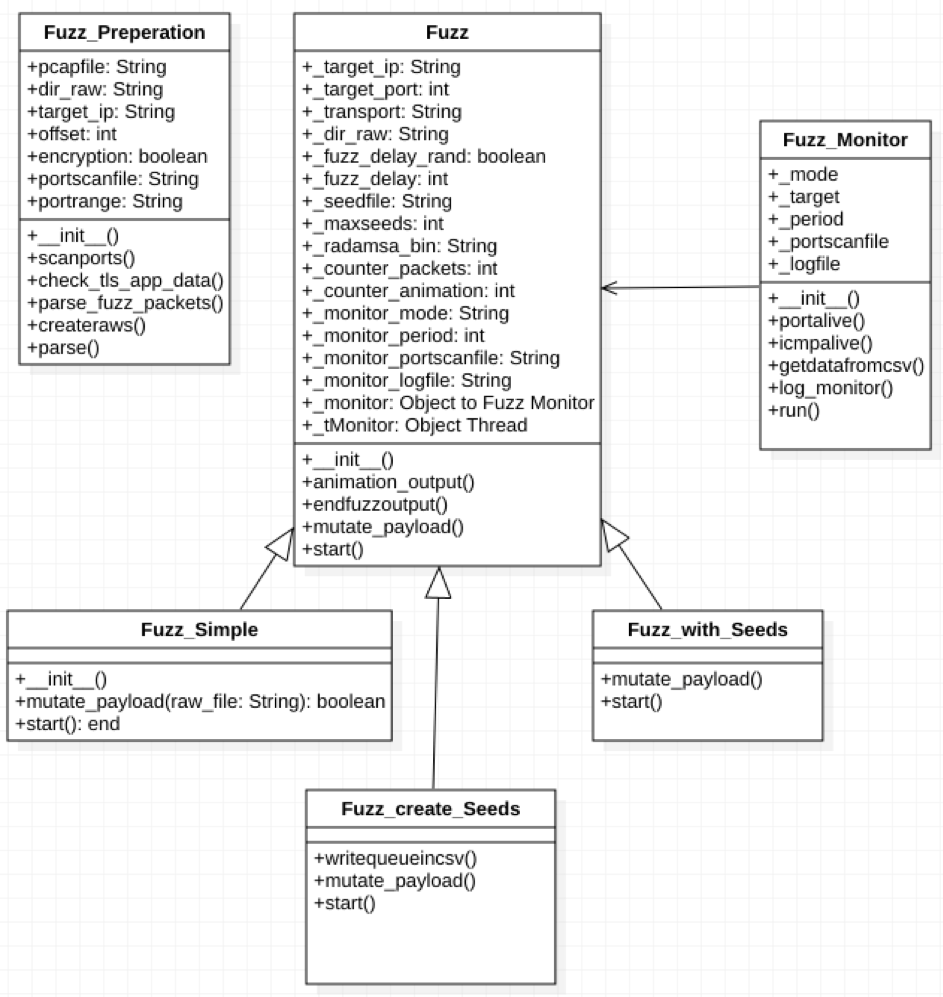
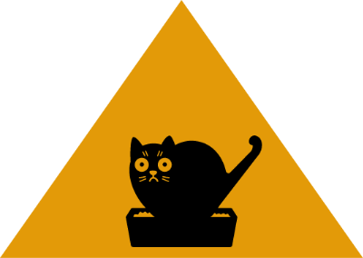

# KotaFuzza
> Release the Kot and Fuzz your Network Services. 


## Table of contents
* [General info](#general-info)
* [Setup](#Setup)
* [How to use KotaFuzza](#how-to-use-kotafuzza)
* [Features](#features)
* [Status](#status)
* [Inspiration](#inspiration)
* [License](#license)
* [Contact](#contact)

## General info
KotaFuzza is a python script framework which can helps to fuzz network services. Right now it is more or less programmed like a dump fuzzer.
It helps you with the collection of packets, that may be useful for fuzzing and also the fuzzing process itself.
You have the choice to fuzz while you are recording the seeds, use a seedfile or just fuzz.
The Monitoring is handled by an Daemon Thread which checks the uptime of the target via ICMP or via Portscan.
KotaFuzza is just an extingtion of the really usefull fuzzing tool radamsa.

## Setup
### [Radamsa Setup](https://gitlab.com/akihe/radamsa)
* on Debian based Linux
```
 $ # please please please fuzz your programs. here is one way to get data for it:
 $ sudo apt-get install gcc make git wget
 $ git clone https://gitlab.com/akihe/radamsa.git && cd radamsa && make && sudo make install
 $ echo "¯\_(ツ)_/¯" | radamsa
```
* on Mac via [brew](http://macappstore.org/radamsa/)
```
$ brew install radamsa
```
### Install python modules via pip
```
$ pip install -r requirements.txt
```
## How to use KotaFuzza
### Prepare Fuzz
This command will create the object x with all parameters, that are needed.
In this example all packets from the test.pcap-file with the target ip address 192.168.1.1 will be stored in the folder raw_packets. It makes sense to parse only the unencrypted packets, which is indicate by True. Sometimes you need an offset, if the packet payload is encapsulated in another protocol to identifie the TLS identifier. In this example the offset is set to 0. 
```python
from KotaFuzza import Fuzz_Preperation

x = Fuzz_Preperation('./test.pcap', './raw_packets/', '192.168.1.1', 0, True)
x.parse()
```
If a port monitoring is needed, the script will also make a portscan, just to check what the "normal" status of the ports is.
The result will be saved in a portscan.csv file.
```python
x.scanports()
```
### Fuzz without any record

```python
from KotaFuzza import Fuzz_Simple

w = Fuzz_Simple('192.168.1.1', 443, 'tcp', './raw_packets/')
w.start()
```

### Fuzz and record the seeds

```python
from KotaFuzza import Fuzz_create_Seeds

z = Fuzz_create_Seeds('192.168.1.1', 443, '../raw_packets/', '../seeds2.txt', 'tcp')
z.start()
```
* It is possible to configure a delay of sending the fuzzed packets by the parameter ```fuzz_delay=X```. The default delay time is 0. There is also to chance to send it with a randomized delay. It can be enabled with the parameter ```fuzz_delay_rand=True```.
* It is possible to change the Monitoring mode by the parameter ```monitor_mode='icmp'```. You can choose ```icmp``` or ```portscan```. ICMP is enabled by default.
* The default value of the maximal seeds, which are recorded, is 200,000. You can change that with the parameter ```maxseeds=X```. KotaFuzza records the last used seeds like a FIFO Queue. 
### Fuzz and use seedfile

```python
from KotaFuzza import Fuzz_with_Seeds

y = Fuzz_with_Seeds('192.168.1.1', 443, './raw_packets/', './seeds.txt', 'tcp')
y.start()
```

* It is possible to change the Monitoring mode by the parameter ```monitor_mode='icmp'```. You can choose ```icmp``` or ```portscan```. ICMP is enabled by default.

### UML-Diagram



## Features
List of features ready
* Extract Fuzzing-Inputs from .pcap-file
* Fuzz and Create Fuzzing Log with Seeds
* Parallel Monitoring of ICMP and Port behaviors

To-do list:
* It needs even more tests to be done
* Detection of possibly answers from target
* And some other stuff which is on my Kanban Board

Further ideas:
* Use a Proxy for TLS-Encryption to encapsulate the fuzzed packets
* Selected Part of payload fuzzing

## Status
This Project is still an _in progress_ prototype

## Inspiration
The script was developed as part of a penetration test and my final project for the Cyber Security Professional certificate at Telekom Security. 
It was inspired by my time in Warsaw at T-Mobile Poland and my collegue [Marcin Kopec](https://pl.linkedin.com/in/mkopec/%7Bcountry%3Dde%2C+language%3Dde%7D?trk=people-guest_profile-result-card_result-card_full-click), who is working there as an excellent Pentester.
The script is using the Fuzzing Tool [Radamsa](https://gitlab.com/akihe/radamsa)

## License

project token : KotaFuzza
Copyright (c) 2019, Fabian Beck, Deutsche Telekom AG
contact: f.beck@t-systems.com
This file is distributed under the conditions of the MIT license.
For details see the files LICENSING, LICENSE, and/or COPYING on the toplevel.

## Contact
Created by fablocke - feel free to contact me!


